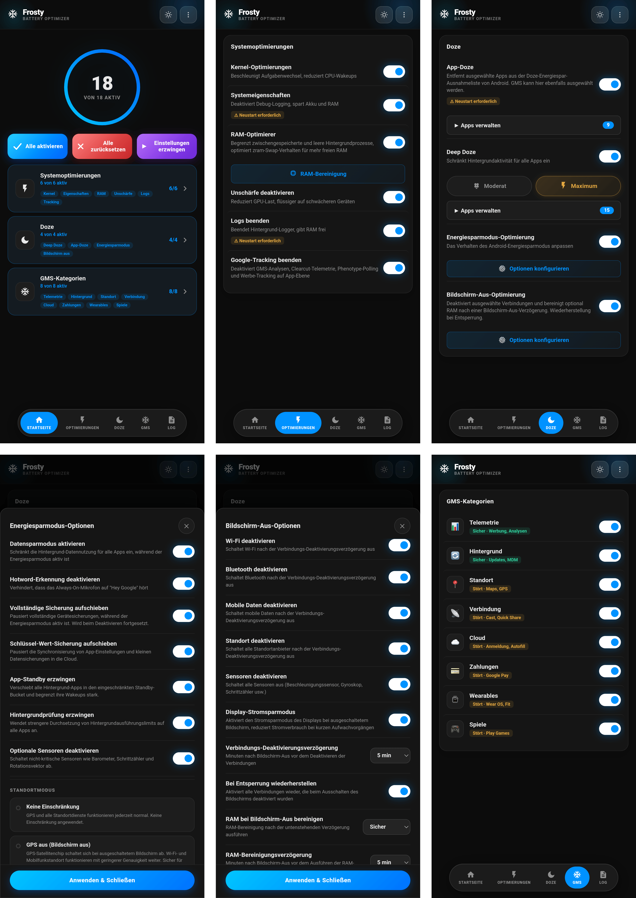

# 🧊 FROSTY

### GMS-Freezer & Akku-Sparer

[Funktionen](#funktionen) • [Installation](#installation) • [Verwendung](#verwendung) • [Kategorien](#gms-kategorien) • [FAQ](#faq)

---

[🇬🇧 English](https://github.com/Drsexo/Frosty) • [🇫🇷 Français](README.fr.md) • 🇩🇪 Deutsch  
[🇵🇱 Polski](README.pl.md) • [🇮🇹 Italiano](README.it.md) • [🇪🇸 Español](README.es.md)  
[🇧🇷 Português](README.pt-BR.md) • [🇹🇷 Türkçe](README.tr.md) • [🇮🇩 Indonesia](README.id.md)  
[🇷🇺 Русский](README.ru.md) • [🇺🇦 Українська](README.uk.md) • [🇨🇳 中文](README.zh-CN.md)  
[🇯🇵 日本語](README.ja.md) • [🇸🇦 العربية](README.ar.md)

## Übersicht

Frosty optimiert die Akkulaufzeit, indem es GMS-Dienste einfriert, systemweite Doze-Verbesserungen anwendet und das Verhalten bei ausgeschaltetem Bildschirm automatisiert. Konfiguriere alles über die WebUI.

## Funktionen

- **GMS Einfrieren**: Deaktiviere GMS-Dienste in 8 Kategorien.
- **App-Doze**: Entferne jede beliebige App aus der Doze-Ausnahmeliste von Android. GMS ist hier ebenfalls auswählbar und ersetzt den alten dedizierten GMS-Doze-Schalter.
- **Deep Doze**: Aggressive Hintergrundbeschränkungen für alle Apps (Moderat / Maximum).
- **Screen-Off-Optimierung**: Deaktiviert ausgewählte Verbindungen (WLAN, Bluetooth, Daten, Standort) und führt optional die RAM-Bereinigung nach einer konfigurierbaren Bildschirm-Aus-Verzögerung aus. Stellt beim Entsperren wieder her.
- **Google-Tracking deaktivieren**: Deaktiviert GMS-Analysen, Clearcut-Telemetrie, Phenotype-Polling und Ad-Tracking.
- **Kernel-Tweaks**: Optimierungen für Scheduler, VM, Netzwerk und Debugging.
- **RAM-Optimierer**: ZRAM-Auto-Tuning, LMK/LMKD/PSI-Schwellen, OEM-Reclaim-Deaktivierung, VM-Speicher-Parameter (Moderat / Maximum), konfigurierbarer RAM-Bereiniger.
- **System-Props**: Deaktiviere Debug-Eigenschaften, um RAM und Akku zu sparen.
- **Logs beenden**: Stoppt akkubelastende Log- und Debugging-Prozesse.
- **Energiespar-Tuner**: Passe an, was der integrierte Android-Energiesparmodus macht, wenn er aktiv ist.

## Installation

**Voraussetzungen:** Android 9+, Magisk 20.4+ / KernelSU / APatch, Google Play-Dienste (GMS)

1. Herunterladen aus [Releases](https://github.com/Drsexo/Frosty/releases).
2. Über deinen Root-Manager installieren.
3. Neustart.
4. WebUI öffnen, um Funktionen zu aktivieren.

> [!NOTE]
> Magisk-Nutzer können [WebUI-X](https://github.com/MMRLApp/WebUI-X-Portable/releases) verwenden, um auf die WebUI zuzugreifen.

## Verwendung

Öffne die WebUI über deinen Root-Manager:

- **System-Tweaks**: Kernel-Tweaks, System-Props, Unschärfe deaktivieren, Logs beenden, Tracking-Blocker, RAM-Optimierer und -Bereiniger.
- **Doze**: App-Doze mit App-Auswahl, Deep Doze mit Level-Auswahl und Whitelist-Editor.
- **Screen-Off-Optimierung**: Schalter pro Verbindung, Verzögerungs-Timer, Wiederherstellung beim Entsperren.
- **GMS-Kategorien**: Friere einzelne GMS-Dienstgruppen ein.
- **Energiespar-Tuner**: Feinabstimmung des Energiesparmodus-Verhaltens.
- **Import / Export**: Sichern und Wiederherstellen deiner gesamten Konfiguration.

## GMS-Kategorien

#### Sicher zu deaktivieren
| Kategorie | Auswirkung |
|----------|--------|
| 📊 **Telemetrie** | Keine. Stoppt Werbung, Analysen, Tracking. |
| 🔄 **Hintergrund** | Automatische Updates können verzögert werden. |

#### Kann Funktionen beeinträchtigen
| Kategorie | Was beeinträchtigt wird |
|----------|-------------|
| 📍 **Standort** | Maps, Navigation, Mein Gerät finden, Standortfreigabe |
| 📡 **Konnektivität** | Chromecast, Quick Share, Fast Pair |
| ☁️ **Cloud** | Google Login, Autofill, Passwörter, Backups |
| 💳 **Zahlungen** | Google Pay, NFC-Kontaktloszahlung |
| ⌚ **Wearables** | Wear OS, Google Fit, Fitness-Tracking |
| 🎮 **Spiele** | Play Games Erfolge, Bestenlisten, Cloud-Speicherstände |

## Deep-Doze-Stufen

Beide Stufen schreiben Doze-Konstanten neu, erzwingen IDLE bei Bildschirm-Aus, führen nach 5 Min. Bildschirm-Aus einen Wakelock-Killer aus und aktivieren JobScheduler flex-idle auf Android 13+. **Maximum** verwendet zusätzlich den `restricted` Standby-Bucket (Moderat verwendet `rare`), verweigert `WAKE_LOCK`, deaktiviert den Bewegungssensor bei Bildschirm-Aus und beendet Wakelocks sofort beim Anwenden.

## RAM-Optimierer

Stellt ZRAM-Kompression, LMK-/LMKD-/PSI-Schwellen, OEM-Reclaim-Nodes und VM-Speicher-Parameter automatisch ein. **Maximum** skaliert LMK-Gewichte um ~60-70% nach oben und verwendet proaktivere LMKD/PSI-Schwellen.
## FAQ

**F: Warum sind meine Benachrichtigungen verzögert?**  
A: App-Doze und Deep Doze schränken die Hintergrundaktivität ein. Füge deine Messenger-Apps in der WebUI zur Deep-Doze-Whitelist hinzu.

**F: Wo ist GMS-Doze geblieben?**  
A: Es ist jetzt Teil von App-Doze. Öffne die App-Doze-Auswahl und wähle GMS – gleicher Effekt, einheitliche Oberfläche.

**F: Funktioniert das auch ohne Google Play-Dienste?**  
A: Kernel-Tweaks, System-Props, Unschärfe deaktivieren, Logs beenden, RAM-Optimierer und -Bereiniger und Deep Doze funktionieren alle. GMS-Funktionen erfordern GMS.

**F: Ist nach der Installation irgendetwas aktiviert?**  
A: Nein. Standardmäßig ist alles ausgeschaltet. Aktiviere nur das, was du brauchst.

## Credits

- **kaushikieeee** [GhostGMS](https://github.com/kaushikieeee/GhostGMS)
- **gloeyisk** [Universal GMS Doze](https://github.com/gloeyisk/universal-gms-doze)
- **Azyrn** [DeepDoze Enforcer](https://github.com/Azyrn/DeepDoze-Enforcer)
- **MoZoiD** [GMS Component Disable Script](https://t.me/MoZoiDStack/137)
- **s1m** [SaverTuner](https://codeberg.org/s1m/savertuner)

## Lizenz

Lizenziert unter **GPL v3**, siehe [LICENSE](LICENSE).  
Der Name **Frosty** ist ausschließlich für offizielle Veröffentlichungen reserviert. Forks müssen einen anderen Namen verwenden und deutlich machen, dass sie inoffiziell sind. Der ursprüngliche Autor übernimmt keine Verantwortung für Schäden, die durch inoffizielle oder modifizierte Versionen verursacht werden.
