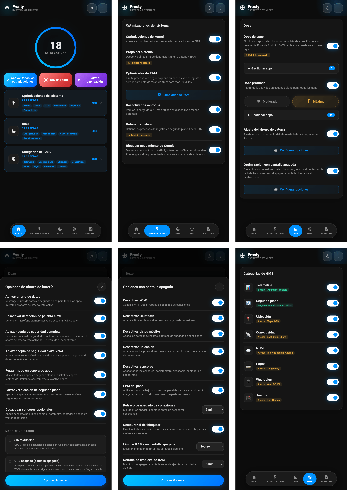

# 🧊 FROSTY

### Congelador de GMS y Ahorro de Batería

[Características](#características) • [Instalación](#instalación) • [Uso](#uso) • [Categorías](#categorías-gms) • [Preguntas Frecuentes](#preguntas-frecuentes)

---

[🇬🇧 English](https://github.com/Drsexo/Frosty) • [🇫🇷 Français](README.fr.md) • [🇩🇪 Deutsch](README.de.md)  
[🇵🇱 Polski](README.pl.md) • [🇮🇹 Italiano](README.it.md) • 🇪🇸 Español  
[🇧🇷 Português](README.pt-BR.md) • [🇹🇷 Türkçe](README.tr.md) • [🇮🇩 Indonesia](README.id.md)  
[🇷🇺 Русский](README.ru.md) • [🇺🇦 Українська](README.uk.md) • [🇨🇳 中文](README.zh-CN.md)  
[🇯🇵 日本語](README.ja.md) • [🇸🇦 العربية](README.ar.md)

## Resumen

Frosty optimiza la duración de la batería congelando los servicios de GMS, aplicando mejoras de Doze en todo el sistema y automatizando el comportamiento al apagar la pantalla. Configura todo a través de la WebUI.

## Características

- **Congelación de GMS**: Desactiva los servicios de GMS en 8 categorías.
- **App Doze**: Elimina cualquier aplicación de la lista de exenciones de ahorro de energía de Doze de Android. GMS también se puede seleccionar aquí, reemplazando el antiguo interruptor dedicado de GMS Doze.
- **Deep Doze**: Restricciones agresivas en segundo plano para todas las aplicaciones (Moderado / Máximo).
- **Optimización con Pantalla Apagada**: Desactiva las conexiones seleccionadas (Wi-Fi, Bluetooth, datos, ubicación) y ejecuta opcionalmente el limpiador de RAM tras un retraso configurable de pantalla apagada, restaura todo al desbloquear.
- **Deshabilitar Rastreo de Google**: Deshabilita los análisis de GMS, la telemetría Clearcut, los sondeos Phenotype y el rastreo de anuncios.
- **Ajustes del Kernel**: Optimizaciones del programador (scheduler), la máquina virtual (VM), red y depuración.
- **Optimizador de RAM**: Autoajuste de ZRAM, umbrales LMK/LMKD/PSI, desactivación de reclaim OEM, parámetros de memoria VM (Moderado / Máximo), limpiador de RAM configurable.
- **Props del Sistema**: Deshabilita las propiedades de depuración para ahorrar RAM y batería.
- **Terminación de Registros**: Detiene los procesos de depuración y registro que consumen batería.
- **Afinador de Ahorro de Batería**: Personaliza lo que hace el ahorro de batería incorporado en Android cuando está activo.

## Instalación

**Requisitos:** Android 9+, Magisk 20.4+ / KernelSU / APatch, Servicios de Google Play (GMS)

1. Descarga desde [Releases](https://github.com/Drsexo/Frosty/releases).
2. Instala a través de tu administrador root.
3. Reinicia el dispositivo.
4. Abre la WebUI para habilitar las características.

> [!NOTE]
> Los usuarios de Magisk pueden usar [WebUI-X](https://github.com/MMRLApp/WebUI-X-Portable/releases) para acceder a la WebUI.

## Uso

Abre la WebUI desde tu administrador root:

- **Ajustes del Sistema**: Ajustes del kernel, props del sistema, desactivación de desenfoque, terminación de registros, deshabilitación de rastreo, optimizador y limpiador de RAM.
- **Doze**: App Doze con selector de aplicaciones, Deep Doze con selector de nivel y editor de lista blanca.
- **Optimización con Pantalla Apagada**: Interruptores por conexión, temporizadores de retraso, restaurar al desbloquear.
- **Categorías de GMS**: Congela grupos individuales de servicios de GMS.
- **Afinador de Ahorro de Batería**: Ajusta el comportamiento del ahorro de batería.
- **Importar / Exportar**: Realiza copias de seguridad y restaura toda tu configuración.

## Categorías GMS

#### Seguro de deshabilitar
| Categoría | Impacto |
|----------|--------|
| 📊 **Telemetría** | Ninguno. Detiene anuncios, analíticas y rastreo. |
| 🔄 **Segundo Plano** | Las actualizaciones automáticas pueden retrasarse. |

#### Puede afectar funcionalidades
| Categoría | Funcionalidades afectadas |
|----------|-------------|
| 📍 **Ubicación** | Maps, navegación, Encontrar mi dispositivo, ubicación compartida |
| 📡 **Conectividad** | Chromecast, Quick Share, Fast Pair |
| ☁️ **Nube** | Inicio de sesión de Google, Autocompletado, contraseñas, copias de seguridad |
| 💳 **Pagos** | Google Pay, pagos sin contacto NFC |
| ⌚ **Dispositivos Vestibles** | Wear OS, Google Fit, seguimiento de estado físico |
| 🎮 **Juegos** | Logros de Play Juegos, tablas de clasificación, partidas guardadas en la nube |

## Niveles de Deep Doze

Ambos niveles reescriben las constantes de Doze, fuerzan IDLE al apagar la pantalla, ejecutan un terminador de wakelocks tras 5 minutos de pantalla apagada y activan la política flex-idle de JobScheduler en Android 13+. **Máximo** adicionalmente usa el bucket de standby `restricted` (Moderado usa `rare`), deniega `WAKE_LOCK`, desactiva el sensor de movimiento al apagar la pantalla y termina wakelocks inmediatamente al aplicar.

## Optimizador de RAM

Autoajusta la compresión ZRAM, los umbrales LMK / LMKD / PSI, los nodos de reclaim OEM y los parámetros de memoria VM. **Máximo** escala los pesos LMK ~60-70% hacia arriba y usa umbrales LMKD/PSI más proactivos.
## Preguntas Frecuentes

**P: ¿Por qué se retrasan mis notificaciones?**  
R: App Doze y Deep Doze restringen la actividad en segundo plano. Agrega tus aplicaciones de mensajería a la lista blanca de Deep Doze en la WebUI.

**P: ¿A dónde fue GMS Doze?**  
R: Ahora es parte de App Doze. Abre el selector de App Doze y elige GMS; tiene el mismo efecto, pero con una interfaz unificada.

**P: ¿Funciona esto sin los Servicios de Google Play?**  
R: Los Ajustes del Kernel, los Props del Sistema, la Desactivación de Desenfoque, la Terminación de Registros, el Optimizador y Limpiador de RAM, y Deep Doze funcionan perfectamente. Las características de GMS requieren tener GMS instalado.

**P: ¿Se habilita algo después de la instalación?**  
R: No. Todo está apagado de forma predeterminada. Habilita solo lo que necesites.

## Créditos

- **kaushikieeee** [GhostGMS](https://github.com/kaushikieeee/GhostGMS)
- **gloeyisk** [Universal GMS Doze](https://github.com/gloeyisk/universal-gms-doze)
- **Azyrn** [DeepDoze Enforcer](https://github.com/Azyrn/DeepDoze-Enforcer)
- **MoZoiD** [Script de desactivación de componentes de GMS](https://t.me/MoZoiDStack/137)
- **s1m** [SaverTuner](https://codeberg.org/s1m/savertuner)

## Licencia

Licenciado bajo **GPL v3**, consulta [LICENSE](LICENSE).  
El nombre **Frosty** está reservado exclusivamente para versiones oficiales. Los forks deben utilizar un nombre diferente y declarar claramente que no son oficiales. El autor original no asume ninguna responsabilidad por los daños causados por versiones no oficiales o modificadas.
