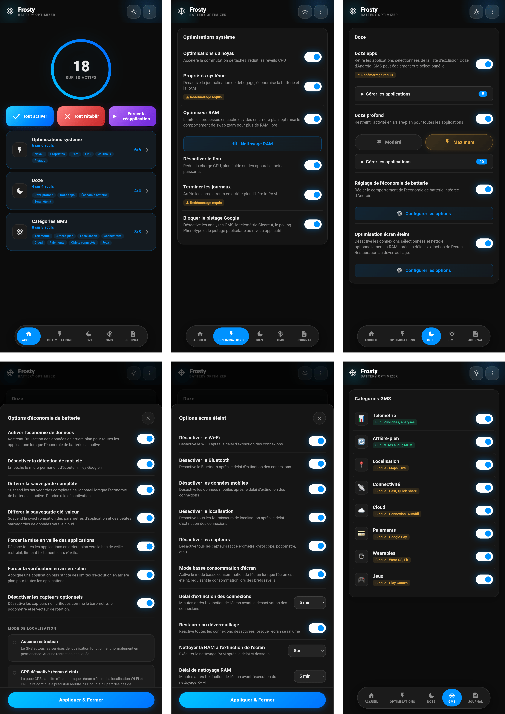

# 🧊 FROSTY

### Congélateur GMS & Économiseur de Batterie

[Fonctionnalités](#fonctionnalités) • [Installation](#installation) • [Utilisation](#utilisation) • [Catégories](#catégories-gms) • [FAQ](#faq)

---

[🇬🇧 English](https://github.com/Drsexo/Frosty) • 🇫🇷 Français • [🇩🇪 Deutsch](README.de.md)  
[🇵🇱 Polski](README.pl.md) • [🇮🇹 Italiano](README.it.md) • [🇪🇸 Español](README.es.md)  
[🇧🇷 Português](README.pt-BR.md) • [🇹🇷 Türkçe](README.tr.md) • [🇮🇩 Indonesia](README.id.md)  
[🇷🇺 Русский](README.ru.md) • [🇺🇦 Українська](README.uk.md) • [🇨🇳 中文](README.zh-CN.md)  
[🇯🇵 日本語](README.ja.md) • [🇸🇦 العربية](README.ar.md)

## Vue d'ensemble

Frosty optimise la durée de vie de la batterie en gelant les services GMS, en appliquant des améliorations de Doze à l'échelle du système et en automatisant le comportement de l'écran éteint. Configurez tout via la WebUI.

## Fonctionnalités

- **Gel des GMS** : Désactivez les services GMS à travers 8 catégories.
- **App Doze** : Retirez n'importe quelle application de la liste d'exemption d'économie d'énergie Doze d'Android. GMS est également sélectionnable ici, remplaçant l'ancien interrupteur dédié GMS Doze.
- **Deep Doze** : Restrictions agressives en arrière-plan pour toutes les applications (Modéré / Maximum).
- **Optimisation Écran Éteint** : Désactive les connexions sélectionnées (Wi-Fi, Bluetooth, données, localisation) et exécute optionnellement le nettoyage RAM après un délai configurable d'extinction de l'écran, restaure au déverrouillage.
- **Désactiver le suivi Google** : Désactive les analyses GMS, la télémétrie Clearcut, le polling Phenotype et le suivi publicitaire.
- **Ajustements du Kernel** : Optimisations du planificateur, de la VM, du réseau et du débogage.
- **Optimiseur de RAM** : Réglage automatique ZRAM, seuils LMK/LMKD/PSI, désactivation de la récupération OEM, paramètres mémoire VM (Modéré / Maximum), Nettoyeur RAM configurable.
- **Props Système** : Désactivez les propriétés de débogage pour économiser la RAM et la batterie.
- **Arrêt des Logs** : Arrête les processus de journalisation (logs) et de débogage qui drainent la batterie.
- **Tuner Économiseur de Batterie** : Personnalisez ce que fait l'économiseur de batterie intégré à Android lorsqu'il est actif.

## Installation

**Prérequis :** Android 9+, Magisk 20.4+ / KernelSU / APatch, Services Google Play (GMS)

1. Téléchargez depuis [Releases](https://github.com/Drsexo/Frosty/releases).
2. Installez via votre gestionnaire root.
3. Redémarrez l'appareil.
4. Ouvrez la WebUI pour activer les fonctionnalités.

> [!NOTE]
> Les utilisateurs de Magisk peuvent utiliser [WebUI-X](https://github.com/MMRLApp/WebUI-X-Portable/releases) pour accéder à la WebUI.

## Utilisation

Ouvrez la WebUI depuis votre gestionnaire root :

- **Ajustements Système** : Ajustements du kernel, props système, désactivation du flou, arrêt des logs, blocage du suivi, optimiseur et nettoyeur RAM.
- **Doze** : App Doze avec sélecteur d'applications, Deep Doze avec sélecteur de niveau et éditeur de liste blanche.
- **Optimisation Écran Éteint** : Interrupteurs par connexion, minuteries de délai, restauration au déverrouillage.
- **Catégories GMS** : Gelez les groupes de services GMS individuels.
- **Tuner Économiseur de Batterie** : Ajustez le comportement de l'économiseur de batterie.
- **Importer / Exporter** : Sauvegardez et restaurez votre configuration complète.

## Catégories GMS

#### Sûr à désactiver
| Catégorie | Impact |
|----------|--------|
| 📊 **Télémétrie** | Aucun. Arrête les publicités, les analyses, le suivi. |
| 🔄 **Arrière-plan** | Les mises à jour automatiques peuvent être retardées. |

#### Peut perturber des fonctionnalités
| Catégorie | Fonctionnalités perturbées |
|----------|-------------|
| 📍 **Localisation** | Maps, navigation, Localiser mon appareil, partage de position |
| 📡 **Connectivité** | Chromecast, Quick Share, Fast Pair |
| ☁️ **Cloud** | Connexion Google, Saisie automatique, mots de passe, sauvegardes |
| 💳 **Paiements** | Google Pay, paiement sans contact NFC |
| ⌚ **Appareils connectés** | Wear OS, Google Fit, suivi de la condition physique |
| 🎮 **Jeux** | Succès Play Jeux, classements, sauvegardes cloud |

## Niveaux de Deep Doze

Les deux niveaux réécrivent les constantes Doze, forcent l'état IDLE à l'extinction de l'écran, exécutent un tueur de wakelocks après 5 minutes d'écran éteint, et activent la politique flex-idle du JobScheduler sur Android 13+. Le niveau **Maximum** utilise en plus le bucket de standby `restricted` (le Modéré utilise `rare`), refuse `WAKE_LOCK`, désactive le capteur de mouvement à l'extinction de l'écran, et tue les wakelocks immédiatement lors de l'application.

## Optimiseur RAM

Réglage automatique de la compression ZRAM, des seuils LMK / LMKD / PSI, des nœuds de récupération OEM et des paramètres mémoire VM. Le niveau **Maximum** augmente les poids LMK d'environ 60-70 % et utilise des seuils LMKD/PSI plus proactifs.
## FAQ

**Q : Pourquoi mes notifications sont-elles retardées ?**  
R : App Doze et Deep Doze restreignent l'activité en arrière-plan. Ajoutez vos applications de messagerie à la liste blanche de Deep Doze dans la WebUI.

**Q : Où est passé GMS Doze ?**  
R : Il fait désormais partie de App Doze. Ouvrez le sélecteur d'App Doze et sélectionnez GMS, même effet, interface unifiée.

**Q : Est-ce que cela fonctionne sans les Services Google Play ?**  
R : Les Ajustements du Kernel, les Props Système, la Désactivation du Flou, l'Arrêt des Logs, l'Optimiseur et Nettoyeur RAM, et Deep Doze fonctionnent tous. Les fonctionnalités GMS nécessitent GMS.

**Q : Est-ce que quelque chose est activé après l'installation ?**  
R : Non. Tout est désactivé par défaut. Activez uniquement ce dont vous avez besoin.

## Crédits

- **kaushikieeee** [GhostGMS](https://github.com/kaushikieeee/GhostGMS)
- **gloeyisk** [Universal GMS Doze](https://github.com/gloeyisk/universal-gms-doze)
- **Azyrn** [DeepDoze Enforcer](https://github.com/Azyrn/DeepDoze-Enforcer)
- **MoZoiD** [Script de désactivation des composants GMS](https://t.me/MoZoiDStack/137)
- **s1m** [SaverTuner](https://codeberg.org/s1m/savertuner)

## Licence

Sous licence **GPL v3**, voir [LICENSE](LICENSE).  
Le nom **Frosty** est réservé exclusivement aux versions officielles. Les forks doivent utiliser un nom différent et indiquer clairement qu'ils ne sont pas officiels. L'auteur original n'assume aucune responsabilité pour les dommages causés par des versions non officielles ou modifiées.
