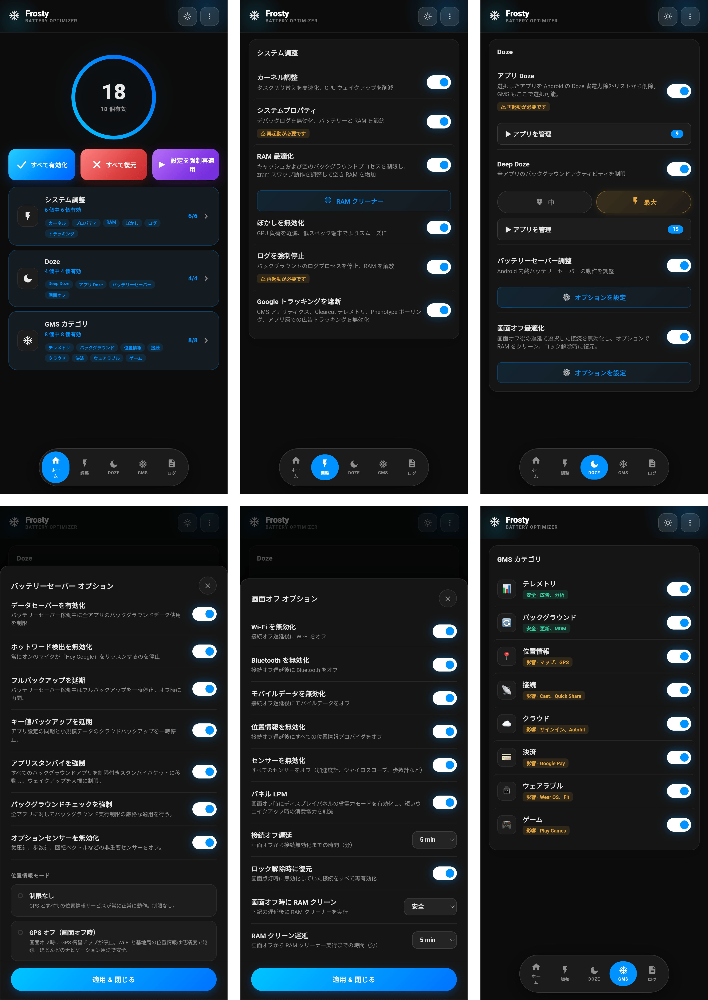

# 🧊 FROSTY

### GMS無効化＆バッテリーセーバー

[機能](#機能) • [インストール](#インストール) • [使い方](#使い方) • [GMSカテゴリー](#gmsカテゴリー) • [FAQ](#よくある質問-faq)

---

[🇬🇧 English](https://github.com/Drsexo/Frosty) • [🇫🇷 Français](README.fr.md) • [🇩🇪 Deutsch](README.de.md)  
[🇵🇱 Polski](README.pl.md) • [🇮🇹 Italiano](README.it.md) • [🇪🇸 Español](README.es.md)  
[🇧🇷 Português](README.pt-BR.md) • [🇹🇷 Türkçe](README.tr.md) • [🇮🇩 Indonesia](README.id.md)  
[🇷🇺 Русский](README.ru.md) • [🇺🇦 Українська](README.uk.md) • [🇨🇳 中文](README.zh-CN.md)  
🇯🇵 日本語 • [🇸🇦 العربية](README.ar.md)

## 概要

Frostyは、GMSサービスの凍結、システム全体のDoze機能の強化、画面オフ時の動作の自動化により、バッテリー寿命を最適化します。すべての設定はWebUIから行えます。

## 機能

- **GMSの凍結**: 8つのカテゴリーにわたってGMSサービスを無効化します。
- **App Doze**: AndroidのDoze省電力除外リストから任意のアプリを削除します。GMSもここで選択でき、従来の専用GMS Dozeスイッチの代わりとなります。
- **Deep Doze**: すべてのアプリに対して積極的なバックグラウンド制限を行います (中程度 / 最大)。
- **画面オフ時の最適化**: 選択した接続 (Wi-Fi、Bluetooth、データ、位置情報) を無効化し、設定可能な画面オフ遅延後にオプションでRAMクリーナーを実行します。ロック解除時に復元されます。
- **Googleトラッキングを無効化**: GMSアナリティクス、Clearcutテレメトリ、Phenotypeポーリング、および広告トラッキングを無効にします。
- **カーネル調整**: スケジューラ、VM、ネットワーク、デバッグの最適化。
- **RAMオプティマイザー**: ZRAM自動チューニング、LMK/LMKD/PSIしきい値、OEM reclaim無効化、VMメモリパラメータ (中程度 / 最大)、設定可能なRAMクリーナー。
- **システムProps**: デバッグプロパティを無効にしてRAMとバッテリーを節約します。
- **ログの終了**: バッテリーを消費するログとデバッグプロセスを強制停止します。
- **バッテリーセーバーチューナー**: Androidに組み込まれているバッテリーセーバーがアクティブになった際の動作をカスタマイズします。

## インストール

**要件:** Android 9以上、Magisk 20.4+ / KernelSU / APatch、Google Play 開発者サービス (GMS)

1. [Releases](https://github.com/Drsexo/Frosty/releases) からダウンロードします。
2. Rootマネージャー経由でインストールします。
3. 再起動します。
4. WebUIを開いて機能を有効にします。

> [!NOTE]
> Magiskユーザーは、[WebUI-X](https://github.com/MMRLApp/WebUI-X-Portable/releases)を使用してWebUIにアクセスできます。

## 使い方

RootマネージャーからWebUIを開きます：

- **システム調整**: カーネル調整、システムProps、ブラー無効化、ログの終了、トラッキングの無効化、RAMオプティマイザーとクリーナー。
- **Doze**: アプリピッカー付きのApp Doze、レベル選択とホワイトリストエディタ付きのDeep Doze。
- **画面オフ時の最適化**: 接続ごとのスイッチ、遅延タイマー、ロック解除時の復元。
- **GMSカテゴリー**: GMSサービスの個々のグループを凍結します。
- **バッテリーセーバーチューナー**: バッテリーセーバーの動作を細かく調整します。
- **インポート / エクスポート**: すべての構成をバックアップおよび復元します。

## GMSカテゴリー

#### 安全に無効化可能
| カテゴリー | 影響 |
|----------|--------|
| 📊 **テレメトリ** | なし。広告、アナリティクス、トラッキングを停止します。 |
| 🔄 **バックグラウンド** | 自動アップデートが遅れる場合があります。 |

#### 機能に支障をきたす可能性あり
| カテゴリー | 影響を受ける機能 |
|----------|-------------|
| 📍 **位置情報** | マップ、ナビゲーション、デバイスを探す、現在地の共有 |
| 📡 **接続性** | Chromecast、Quick Share、Fast Pair |
| ☁️ **クラウド** | Googleサインイン、自動入力、パスワード、バックアップ |
| 💳 **支払い** | Google Pay、NFC非接触決済 |
| ⌚ **ウェアラブル** | Wear OS、Google Fit、フィットネストラッキング |
| 🎮 **ゲーム** | Play ゲームの実績、リーダーボード、クラウドセーブ |

## Deep Doze レベル

両レベルともDoze定数を書き換え、画面オフ時にIDLEを強制し、画面オフ5分後にwakelockキラーを実行し、Android 13+でJobScheduler flex-idleポリシーを有効化します。**最大**はさらに `restricted` スタンバイバケットを使用し (中程度は `rare`)、`WAKE_LOCK` を拒否し、画面オフ時にモーションセンサーを無効化し、適用時に即座にwakelockを終了します。

## RAMオプティマイザー

ZRAM圧縮、LMK / LMKD / PSIしきい値、OEM reclaimノード、VMメモリパラメータを自動チューニングします。**最大**はLMKウェイトを~60-70%引き上げ、よりプロアクティブなLMKD/PSIしきい値を使用します.
## よくある質問 (FAQ)

**Q: 通知が遅れるのはなぜですか？**  
A: App DozeとDeep Dozeはバックグラウンド活動を制限します。メッセージアプリをWebUIのDeep Dozeホワイトリストに追加してください。

**Q: GMS Dozeはどこへ行きましたか？**  
A: 現在はApp Dozeの一部です。App Dozeピッカーを開き、GMSを選択してください。統合されたUIで同じ効果が得られます。

**Q: Google Play 開発者サービスがなくても機能しますか？**  
A: カーネル調整、システムProps、ブラー無効化、ログの終了、RAMオプティマイザー、およびDeep Dozeはすべて機能します。GMS機能は当然GMSを必要とします。

**Q: インストール後にデフォルトで有効になっているものはありますか？**  
A: いいえ。デフォルトではすべてオフになっています。必要なものだけを有効にしてください。

## クレジット

- **kaushikieeee** [GhostGMS](https://github.com/kaushikieeee/GhostGMS)
- **gloeyisk** [Universal GMS Doze](https://github.com/gloeyisk/universal-gms-doze)
- **Azyrn** [DeepDoze Enforcer](https://github.com/Azyrn/DeepDoze-Enforcer)
- **MoZoiD** [GMS Component Disable Script](https://t.me/MoZoiDStack/137)
- **s1m** [SaverTuner](https://codeberg.org/s1m/savertuner)

## ライセンス

**GPL v3** の下でライセンスされています。[LICENSE](LICENSE) を参照してください。  
**Frosty** という名前は公式リリース専用に予約されています。フォーク(派生版)では異なる名前を使用し、非公式であることを明記する必要があります。原作者は、非公式バージョンまたは変更されたバージョンによって生じた損害について一切の責任を負いません。
