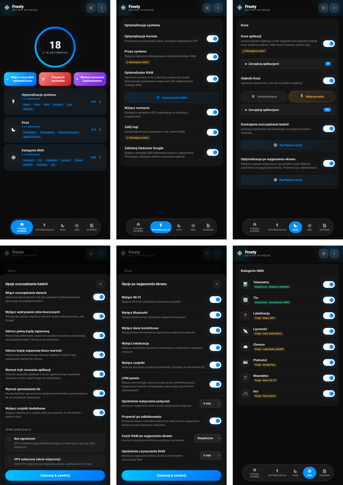

# 🧊 FROSTY

### Zamrażarka GMS i Oszczędzacz Baterii

[Funkcje](#funkcje) • [Instalacja](#instalacja) • [Użytkowanie](#użytkowanie) • [Kategorie](#kategorie-gms) • [FAQ](#faq)

---

[🇬🇧 English](https://github.com/Drsexo/Frosty) • [🇫🇷 Français](README.fr.md) • [🇩🇪 Deutsch](README.de.md)  
🇵🇱 Polski • [🇮🇹 Italiano](README.it.md) • [🇪🇸 Español](README.es.md)  
[🇧🇷 Português](README.pt-BR.md) • [🇹🇷 Türkçe](README.tr.md) • [🇮🇩 Indonesia](README.id.md)  
[🇷🇺 Русский](README.ru.md) • [🇺🇦 Українська](README.uk.md) • [🇨🇳 中文](README.zh-CN.md)  
[🇯🇵 日本語](README.ja.md) • [🇸🇦 العربية](README.ar.md)

## Przegląd

Frosty optymalizuje czas pracy baterii poprzez zamrażanie usług GMS, stosowanie ulepszeń trybu Doze w całym systemie i automatyzację zachowania po wyłączeniu ekranu. Skonfiguruj wszystko przez WebUI.

## Funkcje

- **Zamrażanie GMS**: Wyłącz usługi GMS w 8 kategoriach.
- **App Doze**: Usuń dowolną aplikację z listy wykluczeń z oszczędzania energii Android Doze. GMS można tu również wybrać, zastępując stary dedykowany przełącznik GMS Doze.
- **Deep Doze**: Agresywne restrykcje w tle dla wszystkich aplikacji (Umiarkowane / Maksymalne).
- **Optymalizacja Wyłączonego Ekranu**: Wyłącza wybrane połączenia (Wi-Fi, Bluetooth, dane, lokalizacja) i opcjonalnie uruchamia czyszczenie RAM po konfigurowalnym opóźnieniu wyłączenia ekranu, przywraca wszystko po odblokowaniu.
- **Wyłącz śledzenie Google**: Wyłącza analitykę GMS, telemetrię Clearcut, odpytywanie Phenotype i śledzenie reklam.
- **Modyfikacje Jądra (Kernel Tweaks)**: Optymalizacje harmonogramu (scheduler), maszyny wirtualnej (VM), sieci i debugowania.
- **Optymalizator RAM**: Automatyczne strojenie ZRAM, progi LMK/LMKD/PSI, wyłączanie reclaim OEM, parametry pamięci VM (Umiarkowane / Maksymalne), konfigurowalne czyszczenie RAM.
- **System Props**: Wyłącz właściwości debugowania, aby oszczędzać RAM i baterię.
- **Kasowanie Logów**: Zatrzymaj procesy logowania i debugowania, które zużywają baterię.
- **Dostrajanie Oszczędzania Baterii**: Dostosuj, co robi wbudowane oszczędzanie baterii Androida, gdy jest aktywne.

## Instalacja

**Wymagania:** Android 9+, Magisk 20.4+ / KernelSU / APatch, Usługi Google Play (GMS)

1. Pobierz z [Releases](https://github.com/Drsexo/Frosty/releases).
2. Zainstaluj przez swój menedżer root.
3. Uruchom ponownie (Reboot).
4. Otwórz WebUI, aby włączyć funkcje.

> [!NOTE]
> Użytkownicy Magisk mogą użyć [WebUI-X](https://github.com/MMRLApp/WebUI-X-Portable/releases), aby uzyskać dostęp do WebUI.

## Użytkowanie

Otwórz WebUI ze swojego menedżera root:

- **Modyfikacje Systemu**: Modyfikacje jądra, system props, wyłączenie rozmycia, kasowanie logów, wyłączenie śledzenia, optymalizator i czyszczenie RAM.
- **Doze**: App Doze z wyborem apek, Deep Doze z wyborem poziomu i edytorem białej listy.
- **Optymalizacja Wyłączonego Ekranu**: Przełączniki dla poszczególnych połączeń, opóźnienia, przywracanie po odblokowaniu.
- **Kategorie GMS**: Zamrażaj poszczególne grupy usług GMS.
- **Dostrajanie Oszczędzania Baterii**: Precyzyjne dostrajanie zachowania trybu oszczędzania baterii.
- **Import / Eksport**: Kopia zapasowa i przywracanie pełnej konfiguracji.

## Kategorie GMS

#### Bezpieczne do wyłączenia
| Kategoria | Wpływ |
|----------|--------|
| 📊 **Telemetria** | Brak. Zatrzymuje reklamy, analitykę, śledzenie. |
| 🔄 **Działanie w tle** | Automatyczne aktualizacje mogą być opóźnione. |

#### Może zakłócić funkcje
| Kategoria | Zakłócone funkcje |
|----------|-------------|
| 📍 **Lokalizacja** | Mapy, nawigacja, Znajdź moje urządzenie, udostępnianie lokalizacji |
| 📡 **Łączność** | Chromecast, Quick Share, Szybkie parowanie |
| ☁️ **Chmura** | Logowanie Google, Autouzupełnianie, hasła, kopie zapasowe |
| 💳 **Płatności** | Google Pay, płatności zbliżeniowe NFC |
| ⌚ **Urządzenia noszone** | Wear OS, Google Fit, śledzenie aktywności |
| 🎮 **Gry** | Osiągnięcia Play Games, tabele wyników, zapisy w chmurze |

## Poziomy Deep Doze

Oba poziomy przepisują stałe Doze, wymuszają IDLE po wyłączeniu ekranu, uruchamiają zabójcę wakelocków po 5 minutach wyłączonego ekranu i włączają politykę flex-idle JobScheduler na Androidzie 13+. **Maksymalne** dodatkowo używa bucketu standby `restricted` (Umiarkowane używa `rare`), odmawia `WAKE_LOCK`, wyłącza czujnik ruchu po wyłączeniu ekranu i zabija wakelocki natychmiast przy zastosowaniu.

## Optymalizator RAM

Automatycznie stroi kompresję ZRAM, progi LMK / LMKD / PSI, węzły reclaim OEM i parametry pamięci VM. **Maksymalne** skaluje wagi LMK o ~60-70% w górę i używa bardziej proaktywnych progów LMKD/PSI.
## FAQ

**P: Dlaczego moje powiadomienia są opóźnione?**  
O: App Doze i Deep Doze ograniczają aktywność w tle. Dodaj swoje komunikatory do białej listy Deep Doze w WebUI.

**P: Gdzie podziało się GMS Doze?**  
O: Jest to teraz część App Doze. Otwórz okno wyboru App Doze i wybierz GMS – ten sam efekt, ujednolicony interfejs.

**P: Czy to działa bez Usług Google Play?**  
O: Modyfikacje jądra, System Props, Wyłączenie Rozmycia, Kasowanie Logów, Optymalizator i Czyszczenie RAM, oraz Deep Doze działają bez GMS. Funkcje GMS wymagają GMS.

**P: Czy po instalacji cokolwiek jest włączone?**  
O: Nie. Domyślnie wszystko jest wyłączone. Włącz tylko to, czego potrzebujesz.

## Kredyty

- **kaushikieeee** [GhostGMS](https://github.com/kaushikieeee/GhostGMS)
- **gloeyisk** [Universal GMS Doze](https://github.com/gloeyisk/universal-gms-doze)
- **Azyrn** [DeepDoze Enforcer](https://github.com/Azyrn/DeepDoze-Enforcer)
- **MoZoiD** [Skrypt wyłączający komponenty GMS](https://t.me/MoZoiDStack/137)
- **s1m** [SaverTuner](https://codeberg.org/s1m/savertuner)

## Licencja

Licencja **GPL v3**, zobacz [LICENSE](LICENSE).  
Nazwa **Frosty** jest zarezerwowana wyłącznie dla oficjalnych wydań. Forki muszą używać innej nazwy i wyraźnie zaznaczać, że są nieoficjalne. Oryginalny autor nie ponosi odpowiedzialności za szkody spowodowane przez nieoficjalne lub zmodyfikowane wersje.
