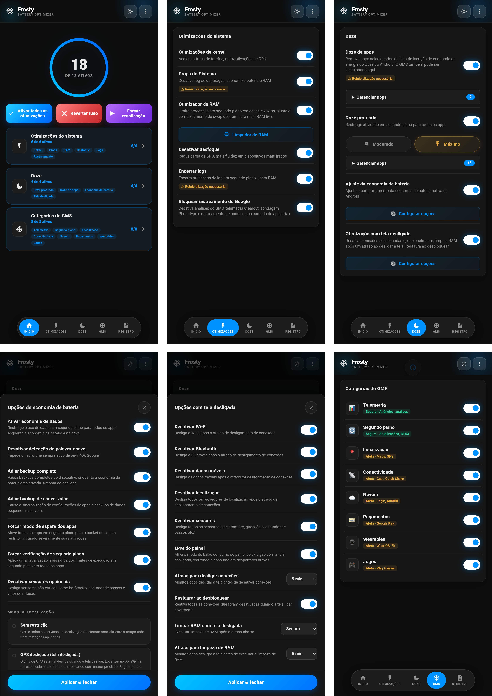

# 🧊 FROSTY

### Congelador de GMS & Economizador de Bateria

[Recursos](#recursos) • [Instalação](#instalação) • [Uso](#uso) • [Categorias](#categorias-gms) • [FAQ](#faq)

---

[🇬🇧 English](https://github.com/Drsexo/Frosty) • [🇫🇷 Français](README.fr.md) • [🇩🇪 Deutsch](README.de.md)  
[🇵🇱 Polski](README.pl.md) • [🇮🇹 Italiano](README.it.md) • [🇪🇸 Español](README.es.md)  
🇧🇷 Português • [🇹🇷 Türkçe](README.tr.md) • [🇮🇩 Indonesia](README.id.md)  
[🇷🇺 Русский](README.ru.md) • [🇺🇦 Українська](README.uk.md) • [🇨🇳 中文](README.zh-CN.md)  
[🇯🇵 日本語](README.ja.md) • [🇸🇦 العربية](README.ar.md)

## Visão Geral

O Frosty otimiza a duração da bateria congelando os serviços do GMS, aplicando melhorias do Doze em todo o sistema e automatizando o comportamento com a tela desligada. Configure tudo através da WebUI.

## Recursos

- **Congelamento do GMS**: Desative os serviços do GMS em 8 categorias.
- **App Doze**: Remova qualquer aplicativo da lista de isenção de economia de energia do Doze do Android. O GMS também pode ser selecionado aqui, substituindo o antigo botão dedicado GMS Doze.
- **Deep Doze**: Restrições agressivas em segundo plano para todos os aplicativos (Moderado / Máximo).
- **Otimização de Tela Desligada**: Desativa as conexões selecionadas (Wi-Fi, Bluetooth, dados, localização) e executa opcionalmente o limpador de RAM após um atraso configurável de tela desligada, restaura tudo ao desbloquear.
- **Desativar Rastreamento do Google**: Desativa as análises do GMS, a telemetria Clearcut, as pesquisas Phenotype e o rastreamento de anúncios.
- **Ajustes do Kernel**: Otimizações de agendamento (scheduler), VM, rede e depuração.
- **Otimizador de RAM**: Autoajuste de ZRAM, limiares LMK/LMKD/PSI, desativação de reclaim OEM, parâmetros de memória VM (Moderado / Máximo), limpador de RAM configurável.
- **Props do Sistema**: Desative as propriedades de depuração para economizar RAM e bateria.
- **Encerramento de Logs**: Pare processos de log e depuração que esgotam a bateria.
- **Afinador de Economia de Bateria**: Personalize o que a economia de bateria integrada do Android faz quando ativa.

## Instalação

**Requisitos:** Android 9+, Magisk 20.4+ / KernelSU / APatch, Google Play Services (GMS)

1. Baixe em [Releases](https://github.com/Drsexo/Frosty/releases).
2. Instale via o seu gerenciador root.
3. Reinicie.
4. Abra a WebUI para habilitar os recursos.

> [!NOTE]
> Usuários do Magisk podem usar a [WebUI-X](https://github.com/MMRLApp/WebUI-X-Portable/releases) para acessar a WebUI.

## Uso

Abra a WebUI do seu gerenciador root:

- **Ajustes do Sistema**: ajustes do kernel, props do sistema, desativar desfoque, encerramento de logs, desativação de rastreamento, otimizador e limpador de RAM.
- **Doze**: App Doze com seletor de aplicativos, Deep Doze com seletor de nível e editor de lista branca.
- **Otimização de Tela Desligada**: interruptores por conexão, cronômetros de atraso, restaurar ao desbloquear.
- **Categorias do GMS**: congele grupos individuais de serviços do GMS.
- **Afinador de Economia de Bateria**: ajuste fino do comportamento de economia de bateria.
- **Importar / Exportar**: faça backup e restaure toda a sua configuração.

## Categorias do GMS

#### Seguro para desativar
| Categoria | Impacto |
|----------|--------|
| 📊 **Telemetria** | Nenhum. Para anúncios, análises e rastreamento. |
| 🔄 **Segundo Plano** | As atualizações automáticas podem sofrer atrasos. |

#### Pode afetar funcionalidades
| Categoria | Funcionalidades afetadas |
|----------|-------------|
| 📍 **Localização** | Maps, navegação, Encontre meu Dispositivo, compartilhamento de localização |
| 📡 **Conectividade** | Chromecast, Quick Share, Fast Pair |
| ☁️ **Nuvem** | Login do Google, Preenchimento automático, senhas, backups |
| 💳 **Pagamentos** | Google Pay, pagamento por aproximação NFC |
| ⌚ **Vestíveis** | Wear OS, Google Fit, rastreamento fitness |
| 🎮 **Jogos** | Conquistas do Play Games, placares, salvamento na nuvem |

## Níveis do Deep Doze

Ambos os níveis reescrevem as constantes Doze, forçam IDLE ao desligar a tela, executam um matador de wakelocks após 5 minutos de tela desligada e ativam a política flex-idle do JobScheduler no Android 13+. **Máximo** adicionalmente usa o bucket de standby `restricted` (Moderado usa `rare`), nega `WAKE_LOCK`, desativa o sensor de movimento ao desligar a tela e mata wakelocks imediatamente ao aplicar.

## Otimizador de RAM

Autoajusta a compressão ZRAM, os limiares LMK / LMKD / PSI, os nós de reclaim OEM e os parâmetros de memória VM. **Máximo** escala os pesos LMK em ~60-70% para cima e usa limiares LMKD/PSI mais proativos.
## FAQ

**P: Por que minhas notificações estão atrasadas?**  
R: O App Doze e o Deep Doze restringem a atividade em segundo plano. Adicione seus aplicativos de mensagens à lista branca do Deep Doze na WebUI.

**P: Para onde foi o GMS Doze?**  
R: Agora faz parte do App Doze. Abra o seletor do App Doze e selecione o GMS, o mesmo efeito, mas em uma interface unificada.

**P: Isso funciona sem o Google Play Services?**  
R: Ajustes do Kernel, Props do Sistema, Desativar Desfoque, Encerramento de Logs, Otimizador e Limpador de RAM, e Deep Doze funcionam todos. Os recursos do GMS exigem o GMS.

**P: Algo está ativado após a instalação?**  
R: Não. Tudo está desligado por padrão. Ative apenas o que você precisa.

## Créditos

- **kaushikieeee** [GhostGMS](https://github.com/kaushikieeee/GhostGMS)
- **gloeyisk** [Universal GMS Doze](https://github.com/gloeyisk/universal-gms-doze)
- **Azyrn** [DeepDoze Enforcer](https://github.com/Azyrn/DeepDoze-Enforcer)
- **MoZoiD** [Script de desativação de componentes do GMS](https://t.me/MoZoiDStack/137)
- **s1m** [SaverTuner](https://codeberg.org/s1m/savertuner)

## Licença

Licenciado sob **GPL v3**, veja [LICENSE](LICENSE).  
O nome **Frosty** é reservado apenas para versões oficiais. Forks devem usar um nome diferente e indicar claramente que não são oficiais. O autor original não assume qualquer responsabilidade por danos causados por versões não oficiais ou modificadas.
