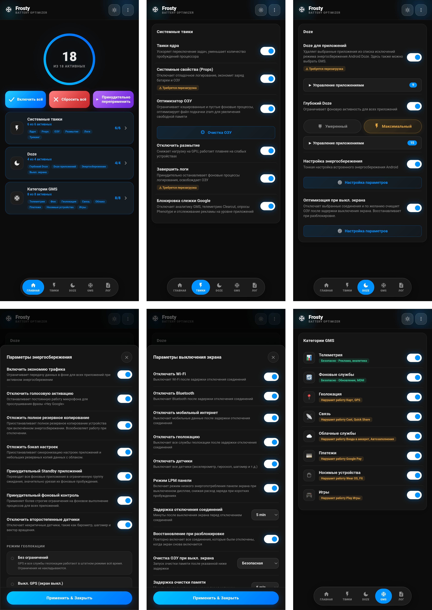

# 🧊 FROSTY

### Заморозка GMS и Энергосбережение

[Функции](#функции) • [Установка](#установка) • [Использование](#использование) • [Категории GMS](#категории-gms) • [ЧАВО](#чаво)

---

[🇬🇧 English](https://github.com/Drsexo/Frosty) • [🇫🇷 Français](README.fr.md) • [🇩🇪 Deutsch](README.de.md)
[🇵🇱 Polski](README.pl.md) • [🇮🇹 Italiano](README.it.md) • [🇪🇸 Español](README.es.md)
[🇧🇷 Português](README.pt-BR.md) • [🇹🇷 Türkçe](README.tr.md) • [🇮🇩 Indonesia](README.id.md)
🇷🇺 Русский • [🇺🇦 Українська](README.uk.md) • [🇨🇳 中文](README.zh-CN.md)
[🇯🇵 日本語](README.ja.md) • [🇸🇦 العربية](README.ar.md)

## Обзор

Frosty оптимизирует время автономной работы за счёт заморозки сервисов GMS, применения общесистемных улучшений режима Doze и автоматизации поведения при выключенном экране. Настройка осуществляется через WebUI.

## Функции

- **Заморозка GMS**: Отключение сервисов GMS в 8 категориях.
- **App Doze**: Удалите любое приложение из белого списка энергосбережения Doze от Android. Выбор GMS теперь доступен здесь же, заменяя старый отдельный переключатель GMS Doze.
- **Deep Doze**: Агрессивные фоновые ограничения для всех приложений (Умеренный / Максимальный).
- **Оптимизация при выключенном экране**: Отключает выбранные соединения (Wi-Fi, Bluetooth, мобильные данные, геолокация) и опционально запускает очистку ОЗУ после настраиваемой задержки выключения экрана, восстанавливает всё при разблокировке.
- **Отключение отслеживания Google**: Отключает аналитику GMS, телеметрию Clearcut, опросы Phenotype и отслеживание рекламы.
- **Твики ядра**: Оптимизация планировщика, виртуальной машины (VM), сети и отладки.
- **Оптимизатор ОЗУ**: Автонастройка ZRAM, пороги LMK/LMKD/PSI, отключение reclaim OEM, параметры памяти VM (Умеренный / Максимальный), настраиваемый очиститель ОЗУ.
- **Системные Props**: Отключение свойств отладки (debug props) для экономии ОЗУ и батареи.
- **Завершение логов**: Принудительная остановка процессов ведения логов и отладки, расходующих батарею.
- **Тюнинг энергосбережения**: Настройка поведения встроенной функции экономии заряда Android во время её работы.

## Установка

**Требования:** Android 9+, Magisk 20.4+ / KernelSU / APatch, Сервисы Google Play

1. Скачайте из раздела [Releases](https://github.com/Drsexo/Frosty/releases).
2. Установите через свой root-менеджер.
3. Перезагрузите устройство.
4. Откройте WebUI, чтобы включить нужные функции.

> [!NOTE]
> Пользователи Magisk могут использовать [WebUI-X](https://github.com/MMRLApp/WebUI-X-Portable/releases) для доступа к WebUI.

## Использование

Откройте WebUI из своего root-менеджера:

- **Системные твики**: твики ядра, системные Props, отключение размытия, завершение логов, блокировка отслеживания, оптимизатор и очиститель ОЗУ.
- **Doze**: App Doze с возможностью выбора приложений, Deep Doze с выбором уровня и редактором белого списка.
- **Оптимизация при выключенном экране**: переключатели для каждого соединения, таймеры задержки, восстановление при разблокировке.
- **Категории GMS**: заморозка отдельных групп служб GMS.
- **Тюнинг энергосбережения**: точная настройка поведения режима энергосбережения.
- **Импорт / Экспорт**: резервное копирование и восстановление всей конфигурации.

## Категории GMS

#### Безопасно для отключения
| Категория | Влияние |
|----------|--------|
| 📊 **Телеметрия** | Никакого. Останавливает рекламу, аналитику, отслеживание. |
| 🔄 **Фон** | Автообновления могут задерживаться. |

#### Может нарушить работу функций
| Категория | Что нарушается |
|----------|-------------|
| 📍 **Местоположение** | Карты, навигация, Найти устройство, обмен местоположением |
| 📡 **Связь** | Chromecast, Quick Share, Fast Pair |
| ☁️ **Облако** | Вход через Google, Автозаполнение, пароли, резервное копирование |
| 💳 **Платежи** | Google Pay, бесконтактная оплата NFC |
| ⌚ **Носимые устройства** | Wear OS, Google Fit, фитнес-трекинг |
| 🎮 **Игры** | Достижения Play Игры, списки лидеров, облачные сохранения |

## Уровни Deep Doze

Оба уровня переписывают константы Doze, принудительно переводят в IDLE при выключенном экране, запускают киллер wakelock через 5 минут выключенного экрана и включают политику flex-idle JobScheduler на Android 13+. **Максимальный** дополнительно использует бакет standby `restricted` (Умеренный использует `rare`), запрещает `WAKE_LOCK`, отключает датчик движения при выключенном экране и убивает wakelock немедленно при применении.

## Оптимизатор ОЗУ

Автонастраивает сжатие ZRAM, пороги LMK / LMKD / PSI, узлы reclaim OEM и параметры памяти VM. **Максимальный** увеличивает веса LMK на ~60-70% и использует более проактивные пороги LMKD/PSI.
## ЧАВО

**В: Почему мои уведомления задерживаются?**
О: App Doze и Deep Doze ограничивают фоновую активность. Добавьте свои мессенджеры в белый список Deep Doze через WebUI.

**В: Куда исчез переключатель GMS Doze?**
О: Теперь он является частью App Doze. Откройте выбор приложений в App Doze и выберите GMS — эффект тот же, но интерфейс стал единым.

**В: Работает ли модуль без сервисов Google Play?**
О: Твики ядра, Системные Props, Отключение размытия, Завершение логов, Оптимизатор и очиститель ОЗУ, и Deep Doze работают без проблем. Для функций GMS требуются сами GMS.

**В: Включено ли что-то сразу после установки?**
О: Нет. По умолчанию всё выключено. Включайте только то, что вам нужно.

## Благодарности

- **kaushikieeee** [GhostGMS](https://github.com/kaushikieeee/GhostGMS)
- **gloeyisk** [Universal GMS Doze](https://github.com/gloeyisk/universal-gms-doze)
- **Azyrn** [DeepDoze Enforcer](https://github.com/Azyrn/DeepDoze-Enforcer)
- **MoZoiD** [Скрипт отключения компонентов GMS](https://t.me/MoZoiDStack/137)
- **s1m** [SaverTuner](https://codeberg.org/s1m/savertuner)

## Лицензия

Лицензировано под **GPL v3**, см. [LICENSE](LICENSE).
Имя **Frosty** зарезервировано только для официальных релизов. Форки должны использовать другое имя и чётко указывать, что они неофициальные. Оригинальный автор не несёт никакой ответственности за ущерб, причинённый неофициальными или модифицированными версиями.
