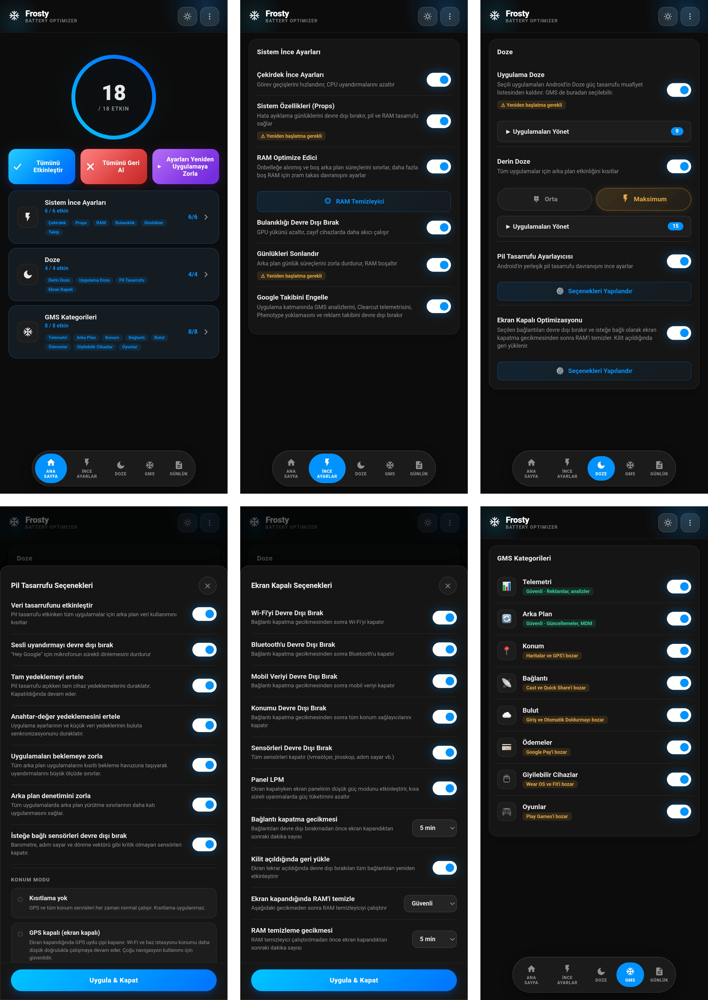

# 🧊 FROSTY

### GMS Dondurucu ve Pil Tasarrufu

[Özellikler](#özellikler) • [Kurulum](#kurulum) • [Kullanım](#kullanım) • [Kategoriler](#gms-kategorileri) • [SSS](#sss)

---

[🇬🇧 English](https://github.com/Drsexo/Frosty) • [🇫🇷 Français](README.fr.md) • [🇩🇪 Deutsch](README.de.md)
[🇵🇱 Polski](README.pl.md) • [🇮🇹 Italiano](README.it.md) • [🇪🇸 Español](README.es.md)
[🇧🇷 Português](README.pt-BR.md) • 🇹🇷 Türkçe • [🇮🇩 Indonesia](README.id.md)
[🇷🇺 Русский](README.ru.md) • [🇺🇦 Українська](README.uk.md) • [🇨🇳 中文](README.zh-CN.md)
[🇯🇵 日本語](README.ja.md) • [🇸🇦 العربية](README.ar.md)

## Genel Bakış

Frosty, GMS hizmetlerini dondurarak, sistem genelinde Doze iyileştirmeleri uygulayarak ve ekran kapalı davranışını otomatikleştirerek pil ömrünü optimize eder. Her şeyi WebUI üzerinden yapılandırabilirsiniz.

## Özellikler

- **GMS Dondurma**: 8 kategori genelinde GMS hizmetlerini devre dışı bırakın.
- **App Doze**: İstediğiniz herhangi bir uygulamayı Android'in Doze güç tasarrufu istisna listesinden çıkarın. Eski özel GMS Doze geçişinin yerini alarak GMS de buradan seçilebilir.
- **Deep Doze**: Tüm uygulamalar için agresif arka plan kısıtlamaları (Orta / Maksimum).
- **Ekran Kapalı Optimizasyonu**: Seçili bağlantıları (Wi-Fi, Bluetooth, mobil veri, konum) devre dışı bırakır ve yapılandırılabilir bir ekran kapalı gecikmesinden sonra isteğe bağlı olarak RAM temizleyiciyi çalıştırır, kilit açıldığında her şeyi geri yükler.
- **Google İzlemeyi Devre Dışı Bırakma**: GMS analizlerini, Clearcut telemetrisini, Phenotype sorgulamalarını ve reklam izlemeyi devre dışı bırakır.
- **Çekirdek (Kernel) Ayarları**: Zamanlayıcı (scheduler), VM, ağ ve hata ayıklama optimizasyonları.
- **RAM İyileştirici**: ZRAM otomatik ayarı, LMK/LMKD/PSI eşikleri, OEM reclaim devre dışı bırakma, VM bellek parametreleri (Orta / Maksimum), yapılandırılabilir RAM Temizleyici.
- **Sistem Props**: RAM ve pilden tasarruf etmek için hata ayıklama (debug) özelliklerini devre dışı bırakın.
- **Günlükleri Sonlandırma**: Pili tüketen günlük (log) ve hata ayıklama işlemlerini zorla durdurun.
- **Pil Tasarrufu Ayarlayıcı**: Etkinken Android'in yerleşik pil tasarrufunun ne yapacağını özelleştirin.

## Kurulum

**Gereksinimler:** Android 9+, Magisk 20.4+ / KernelSU / APatch, Google Play Hizmetleri

1. [Releases](https://github.com/Drsexo/Frosty/releases) sayfasından indirin.
2. Root yöneticiniz aracılığıyla kurun.
3. Yeniden başlatın.
4. Özellikleri etkinleştirmek için WebUI'yi açın.

> [!NOTE]
> Magisk kullanıcıları WebUI'ye erişmek için [WebUI-X](https://github.com/MMRLApp/WebUI-X-Portable/releases) kullanabilir.

## Kullanım

Root yöneticinizden WebUI'yi açın:

- **Sistem İnce Ayarları**: Çekirdek ayarları, sistem Props, bulanıklığı devre dışı bırakma, günlükleri sonlandırma, izleme engelleme, RAM iyileştirici ve temizleyici.
- **Doze**: Uygulama seçici ile App Doze, seviye seçici ve beyaz liste düzenleyicisi ile Deep Doze.
- **Ekran Kapalı Optimizasyonu**: Bağlantı başına geçişler, gecikme zamanlayıcıları, kilit açıldığında geri yükleme.
- **GMS Kategorileri**: Ayrı ayrı GMS hizmet gruplarını dondurun.
- **Pil Tasarrufu Ayarlayıcı**: Pil tasarrufu davranışına ince ayar yapın.
- **İçe / Dışa Aktar**: Tam yapılandırmanızı yedekleyin ve geri yükleyin.

## GMS Kategorileri

#### Devre Dışı Bırakmak Güvenli
| Kategori | Etki |
|----------|--------|
| 📊 **Telemetri** | Yok. Reklamları, analizleri ve izlemeyi durdurur. |
| 🔄 **Arka Plan** | Otomatik güncellemeler gecikebilir. |

#### Özellikleri Bozabilir
| Kategori | Bozulan Özellikler |
|----------|-------------|
| 📍 **Konum** | Haritalar, navigasyon, Cihazımı Bul, konum paylaşımı |
| 📡 **Bağlantı** | Chromecast, Quick Share, Fast Pair |
| ☁️ **Bulut** | Google ile oturum açma, Otomatik doldurma, şifreler, yedekleme |
| 💳 **Ödemeler** | Google Pay, NFC temassız ödeme |
| ⌚ **Giyilebilir Cihazlar** | Wear OS, Google Fit, fitness takibi |
| 🎮 **Oyunlar** | Play Oyunlar başarımları, skor tabloları, bulut kayıtları |

## Deep Doze Seviyeleri

Her iki seviye de Doze sabitlerini yeniden yazar, ekran kapandığında IDLE durumuna zorlar, ekran kapalı 5 dakika sonra bir wakelock sonlandırıcı çalıştırır ve Android 13+ üzerinde JobScheduler flex-idle politikasını etkinleştirir. **Maksimum** ayrıca `restricted` standby bucket'ını kullanır (Orta `rare` kullanır), `WAKE_LOCK`'u reddeder, ekran kapandığında hareket sensörünü devre dışı bırakır ve uygulama sırasında wakelock'ları anında sonlandırır.

## RAM İyileştirici

ZRAM sıkıştırmasını, LMK / LMKD / PSI eşiklerini, OEM reclaim düğümlerini ve VM bellek parametrelerini otomatik olarak ayarlar. **Maksimum** LMK ağırlıklarını ~%60-70 yukarı ölçekler ve daha proaktif LMKD/PSI eşikleri kullanır.
## SSS

**S: Bildirimlerim neden gecikiyor?**
C: App Doze ve Deep Doze arka plan etkinliğini kısıtlar. Mesajlaşma uygulamalarınızı WebUI'deki Deep Doze beyaz listesine ekleyin.

**S: GMS Doze nereye gitti?**
C: Artık App Doze'un bir parçası. App Doze seçiciyi açın ve GMS'i seçin; aynı etkiyi sağlayan birleşik bir arayüzdür.

**S: Bu, Google Play Hizmetleri olmadan çalışır mı?**
C: Çekirdek Ayarları, Sistem Props, Bulanıklığı Devre Dışı Bırakma, Günlükleri Sonlandırma, RAM İyileştirici ve Temizleyici, ve Deep Doze sorunsuz çalışır. GMS özellikleri GMS gerektirir.

**S: Kurulumdan sonra herhangi bir şey etkinleştiriliyor mu?**
C: Hayır. Varsayılan olarak her şey kapalıdır. Yalnızca ihtiyacınız olanları etkinleştirin.

## Krediler

- **kaushikieeee** [GhostGMS](https://github.com/kaushikieeee/GhostGMS)
- **gloeyisk** [Universal GMS Doze](https://github.com/gloeyisk/universal-gms-doze)
- **Azyrn** [DeepDoze Enforcer](https://github.com/Azyrn/DeepDoze-Enforcer)
- **MoZoiD** [GMS Bileşeni Devre Dışı Bırakma Betiği](https://t.me/MoZoiDStack/137)
- **s1m** [SaverTuner](https://codeberg.org/s1m/savertuner)

## Lisans

**GPL v3** altında lisanslanmıştır, bkz. [LICENSE](LICENSE).
**Frosty** adı yalnızca resmi sürümler için ayrılmıştır. Fork (çatal) projeler farklı bir ad kullanmalı ve resmi olmadıklarını açıkça belirtmelidir. Orijinal yazar, resmi olmayan veya değiştirilmiş sürümlerin neden olduğu hasarlardan hiçbir sorumluluk kabul etmez.
