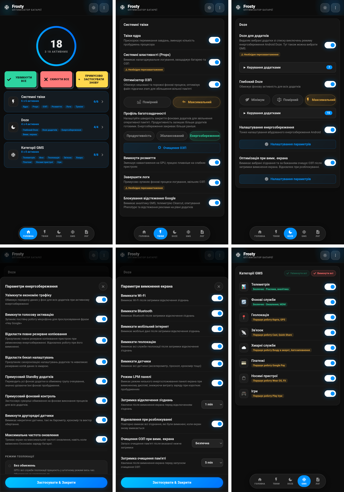

# 🧊 FROSTY

### Заморозка GMS та Енергозбереження

[Функції](#функції) • [Встановлення](#встановлення) • [Використання](#використання) • [Категорії GMS](#категорії-gms) • [FAQ](#faq)

---

[🇬🇧 English](https://github.com/Drsexo/Frosty) • [🇫🇷 Français](README.fr.md) • [🇩🇪 Deutsch](README.de.md)
[🇵🇱 Polski](README.pl.md) • [🇮🇹 Italiano](README.it.md) • [🇪🇸 Español](README.es.md)
[🇧🇷 Português](README.pt-BR.md) • [🇹🇷 Türkçe](README.tr.md) • [🇮🇩 Indonesia](README.id.md)
[🇷🇺 Русский](README.ru.md) • 🇺🇦 Українська • [🇨🇳 中文](README.zh-CN.md)
[🇯🇵 日本語](README.ja.md) • [🇸🇦 العربية](README.ar.md)

## Огляд

Frosty оптимізує час роботи від батареї за рахунок заморозки служб GMS, застосування загальносистемних покращень режиму Doze та автоматизації поведінки при вимкненому екрані. Налаштовуйте все через WebUI.

## Функції

- **Заморозка GMS**: Вимкнення служб GMS у 8 категоріях.
- **App Doze**: Вилучіть будь-який додаток з білого списку енергозбереження Doze від Android. Вибір GMS також доступний тут, замінюючи старий окремий перемикач GMS Doze.
- **Deep Doze**: Агресивні фонові обмеження для всіх додатків (Помірний / Максимальний).
- **Оптимізація при вимкненому екрані**: Вимикає вибрані з'єднання (Wi-Fi, Bluetooth, мобільні дані, геолокація) та опціонально запускає очистку ОЗП після настроюваної затримки вимкнення екрана, відновлює все при розблокуванні.
- **Відключення відстеження Google**: Вимикає аналітику GMS, телеметрію Clearcut, опитування Phenotype та відстеження реклами.
- **Твіки ядра**: Оптимізація планувальника, віртуальної машини (VM), мережі та налагодження.
- **Оптимізатор ОЗП**: Автоналаштування ZRAM, пороги LMK/LMKD/PSI, вимкнення reclaim OEM, параметри пам'яті VM (Помірний / Максимальний), налаштовуваний очистник ОЗП, Профіль багатозадачності (Продуктивність / Збалансований / Енергозбереження).
- **Системні Props**: Вимкніть властивості налагодження (debug props) для економії ОЗП та батареї.
- **Завершення логів**: Примусова зупинка процесів ведення логів та налагодження, що витрачають батарею.
- **Тюнінг енергозбереження**: Налаштуйте поведінку вбудованої функції економії заряду Android під час її роботи, включаючи опцію збереження максимальної частоти оновлення під час її роботи.

## Встановлення

**Вимоги:** Android 9+, Magisk 20.4+ / KernelSU / APatch, Сервіси Google Play

1. Завантажте з розділу [Releases](https://github.com/Drsexo/Frosty/releases).
2. Встановіть через свій root-менеджер.
3. Перезавантажте пристрій.
4. Відкрийте WebUI, щоб увімкнути потрібні функції.

> [!NOTE]
> Користувачі Magisk можуть використовувати [KsuWebUI](https://github.com/KOWX712/KsuWebUIStandalone/releases) / [WebUI-X](https://github.com/MMRLApp/WebUI-X-Portable/releases) для доступу до WebUI.

> [!NOTE]
> На KernelSU/APatch Frosty запитує гаряче встановлення. Якщо ваш менеджер це підтримує, оновіть WebUI після встановлення замість перезавантаження. Перезавантажте, якщо щось працює некоректно. Magisk завжди вимагає перезавантаження.

## Використання

Відкрийте WebUI зі свого root-менеджера:

- **Системні твіки**: твіки ядра, системні Props, вимкнення розмиття, завершення логів, блокування відстеження, оптимізатор і очистник ОЗП.
- **Doze**: App Doze з можливістю вибору додатків, Deep Doze з вибором рівня та редактором білого списку.
- **Оптимізація при вимкненому екрані**: перемикачі для кожного з'єднання, таймери затримки, відновлення при розблокуванні.
- **Категорії GMS**: заморозка окремих груп служб GMS, або використовуйте Увімкнути всі / Вимкнути всі для масової обробки тих, що ще не в потрібному стані.
- **Тюнінг енергозбереження**: точне налаштування поведінки режиму енергозбереження.
- **Імпорт / Експорт**: резервне копіювання та відновлення всієї конфігурації.

## Категорії GMS

#### Безпечно для вимкнення
| Категорія | Вплив |
|----------|--------|
| 📊 **Телеметрія** | Жодного. Зупиняє рекламу, аналітику, відстеження. |
| 🔄 **Фон** | Автооновлення можуть затримуватись. |

#### Може порушити роботу функцій
| Категорія | Що порушується |
|----------|-------------|
| 📍 **Геолокація** | Карти, навігація, Знайти пристрій, обмін геоданими |
| 📡 **Зв'язок** | Chromecast, Quick Share, Fast Pair |
| ☁️ **Хмара** | Вхід через Google, Автозаповнення, паролі, резервне копіювання |
| 💳 **Платежі** | Google Pay, безконтактна оплата NFC |
| ⌚ **Носимі пристрої** | Wear OS, Google Fit, фітнес-трекінг |
| 🎮 **Ігри** | Досягнення Play Ігри, таблиці лідерів, хмарні збереження |

## Рівні Deep Doze

Обидва рівні переписують константи Doze, примусово переводять у IDLE, поки пристрій заблокований, запускають кілера wakelock через 5 хвилин блокування та вмикають політику flex-idle JobScheduler на Android 13+. Обмеження слідують за станом блокування, а не станом екрана: перевірка часу або погляд на ambient-дисплей нічого не скидає, лише розблокування. **Максимальний** додатково використовує бакет standby `restricted` (Помірний використовує `rare`), забороняє `WAKE_LOCK`, вимикає датчик руху під час блокування та вбиває wakelock негайно при застосуванні.

## Оптимізатор ОЗП

Автоналаштовує стиснення ZRAM, пороги LMK / LMKD / PSI, вузли reclaim OEM та параметри пам'яті VM. **Максимальний** збільшує ваги LMK на ~60-70% і використовує більш проактивні пороги LMKD/PSI. Профіль багатозадачності (Продуктивність / Збалансований / Енергозбереження) окремо контролює, скільки фонових додатків ActivityManager утримує готовими до миттєвого відновлення.
## FAQ

**П: Чому мої сповіщення затримуються?**
В: App Doze та Deep Doze обмежують фонову активність. Додайте свої месенджери до білого списку Deep Doze через WebUI. Сам GMS/Firebase за замовчуванням у білому списку, тому доставка push залишається незмінною, але сторонні месенджери все одно потрібно додати до білого списку Deep Doze через WebUI.

**П: Куди зник перемикач GMS Doze?**
В: Тепер він є частиною App Doze. Відкрийте вибір додатків в App Doze та виберіть GMS — ефект той самий, але інтерфейс став єдиним.

**П: Чи працює модуль без сервісів Google Play?**
В: Твіки ядра, Системні Props, Вимкнення розмиття, Завершення логів, Оптимізатор і очистник ОЗП, і Deep Doze працюють без проблем. Для функцій GMS потрібні самі GMS.

**П: Чи ввімкнено щось одразу після встановлення?**
В: Ні. За замовчуванням все вимкнено. Вмикайте лише те, що вам потрібно.

## Подяки

- **kaushikieeee** [GhostGMS](https://github.com/kaushikieeee/GhostGMS)
- **gloeyisk** [Universal GMS Doze](https://github.com/gloeyisk/universal-gms-doze)
- **Azyrn** [DeepDoze Enforcer](https://github.com/Azyrn/DeepDoze-Enforcer)
- **MoZoiD** [Скрипт вимкнення компонентів GMS](https://t.me/MoZoiDStack/137)
- **s1m** [SaverTuner](https://codeberg.org/s1m/savertuner)
- [xizt158](https://github.com/xizt159) за численні якісні внески

## Ліцензія

Ліцензовано за **GPL v3**, див. [LICENSE](LICENSE).
Ім'я **Frosty** зарезервовано лише для офіційних релізів. Форки повинні використовувати інше ім'я та чітко вказувати, що вони неофіційні. Оригінальний автор не несе жодної відповідальності за шкоду, заподіяну неофіційними або модифікованими версіями.
