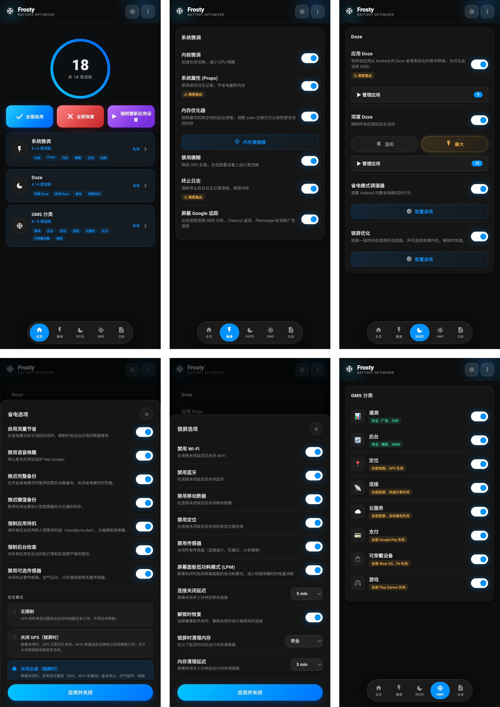

# 🧊 FROSTY

### GMS 冻结器与省电工具

[功能](#功能) • [安装](#安装) • [使用方法](#使用方法) • [GMS 类别](#gms-类别) • [常见问题](#常见问题)

---

[🇬🇧 English](https://github.com/Drsexo/Frosty) • [🇫🇷 Français](README.fr.md) • [🇩🇪 Deutsch](README.de.md)
[🇵🇱 Polski](README.pl.md) • [🇮🇹 Italiano](README.it.md) • [🇪🇸 Español](README.es.md)
[🇧🇷 Português](README.pt-BR.md) • [🇹🇷 Türkçe](README.tr.md) • [🇮🇩 Indonesia](README.id.md)
[🇷🇺 Русский](README.ru.md) • [🇺🇦 Українська](README.uk.md) • 🇨🇳 中文
[🇯🇵 日本語](README.ja.md) • [🇸🇦 العربية](README.ar.md)

## 概述

Frosty 通过冻结 GMS 服务、应用系统级 Doze 增强以及自动化息屏行为来优化电池续航。你可以通过 WebUI 配置所有内容。

## 功能

- **GMS 冻结**：在 8 个类别中禁用 GMS 服务。
- **App Doze**：将任何应用从 Android 的 Doze 省电豁免名单中移除。这里也支持选择 GMS，从而取代了旧版专用的 GMS Doze 开关。
- **Deep Doze**：对所有应用实施激进的后台限制（中度 / 最高）。
- **息屏优化**：禁用所选连接（Wi-Fi、蓝牙、移动数据、定位），并在可配置的息屏延迟后可选运行 RAM 清理器，解锁时恢复所有内容。
- **禁用 Google 跟踪**：禁用 GMS 分析、Clearcut 遥测、Phenotype 轮询以及广告跟踪。
- **内核优化**：调度器、虚拟机 (VM)、网络和调试优化。
- **RAM 优化器**：ZRAM 自动调优、LMK/LMKD/PSI 阈值、OEM reclaim 禁用、VM 内存参数（中度 / 最高），可配置的 RAM 清理器。
- **系统 Props**：禁用调试属性以节省 RAM 和电池。
- **终止日志**：强制停止耗电的日志记录和调试进程。
- **省电模式调节器**：自定义 Android 内置省电模式处于活动状态时的行为。

## 安装

**要求：** Android 9+，Magisk 20.4+ / KernelSU / APatch，Google Play 服务

1. 从 [Releases](https://github.com/Drsexo/Frosty/releases) 下载。
2. 通过您的 root 管理器安装。
3. 重启设备。
4. 打开 WebUI 启用相关功能。

> [!NOTE]
> Magisk 用户可以使用 [WebUI-X](https://github.com/MMRLApp/WebUI-X-Portable/releases) 来访问 WebUI。

## 使用方法

通过您的 root 管理器打开 WebUI：

- **系统优化**：内核优化、系统 Props、禁用模糊、终止日志、禁用跟踪、RAM 优化器和清理器。
- **Doze**：带有应用选择器的 App Doze，以及带有级别选择和白名单编辑器的 Deep Doze。
- **息屏优化**：每项连接的独立开关、延迟计时器、解锁时恢复。
- **GMS 类别**：冻结单独的 GMS 服务组。
- **省电模式调节器**：微调省电模式的行为。
- **导入 / 导出**：备份和恢复您的完整配置。

## GMS 类别

#### 安全禁用
| 类别 | 影响 |
|----------|--------|
| 📊 **遥测** | 无。停止广告、分析和跟踪。 |
| 🔄 **后台** | 自动更新可能会延迟。 |

#### 可能导致功能异常
| 类别 | 受影响功能 |
|----------|-------------|
| 📍 **定位** | 地图、导航、查找我的设备、位置共享 |
| 📡 **连接** | Chromecast、Quick Share、Fast Pair |
| ☁️ **云** | Google 登录、自动填充、密码、备份 |
| 💳 **支付** | Google Pay、NFC 非接触式支付 |
| ⌚ **可穿戴设备** | Wear OS、Google Fit、健身追踪 |
| 🎮 **游戏** | Play 游戏成就、排行榜、云存档 |

## Deep Doze 级别

两个级别都会重写 Doze 常量、在息屏时强制 IDLE 状态、在息屏 5 分钟后运行 wakelock 终止器，并在 Android 13+ 上启用 JobScheduler flex-idle 策略。**最高**级别还会使用 `restricted` 待机桶（中度使用 `rare`）、拒绝 `WAKE_LOCK`、在息屏时禁用运动传感器，并在应用时立即终止 wakelock。

## RAM 优化器

自动调优 ZRAM 压缩、LMK / LMKD / PSI 阈值、OEM reclaim 节点和 VM 内存参数。**最高**级别将 LMK 权重提高约 60-70%，并使用更积极的 LMKD/PSI 阈值。
## 常见问题

**问：为什么我的通知会延迟？**
答：App Doze 和 Deep Doze 会限制后台活动。请在 WebUI 中将您的即时通讯应用添加到 Deep Doze 白名单中。

**问：GMS Doze 去哪了？**
答：它现在属于 App Doze 的一部分。打开 App Doze 选择器并选择 GMS，效果是一样的，只是界面更加统一。

**问：如果没有 Google Play 服务，这个模块还能用吗？**
答：内核优化、系统 Props、禁用模糊、终止日志、RAM 优化器和清理器、以及 Deep Doze 都可以正常工作。GMS 功能需要安装 GMS。

**问：安装后默认会启用什么功能吗？**
答：不会。默认情况下所有功能都是关闭的。请仅启用您需要的功能。

## 鸣谢

- **kaushikieeee** [GhostGMS](https://github.com/kaushikieeee/GhostGMS)
- **gloeyisk** [Universal GMS Doze](https://github.com/gloeyisk/universal-gms-doze)
- **Azyrn** [DeepDoze Enforcer](https://github.com/Azyrn/DeepDoze-Enforcer)
- **MoZoiD** [GMS 组件禁用脚本](https://t.me/MoZoiDStack/137)
- **s1m** [SaverTuner](https://codeberg.org/s1m/savertuner)

## 许可证

基于 **GPL v3** 许可，详见 [LICENSE](LICENSE)。
**Frosty** 的名称仅保留给官方发布版本。Fork 必须使用不同的名称，并明确声明它们是非官方的。原作者对非官方或修改版本造成的损坏不承担任何责任。
